---

## `> WHAT.I.BUILD`

- **Drone systems:** ground control dashboards, MAVLink and WebSockets, live multi-drone monitoring
- **Computer vision:** real-time detection and tracking with YOLOv8 + DeepSORT
- **Algorithms:** pathfinding, motion planning and route optimization

---

## `> FEATURED.PROJECTS`

---

## `> NOW`

- **Building:** EDIT_ME (your current project, with a link)
- **Learning:** EDIT_ME (for example: sensor fusion, ROS 2, model deployment)
- **Looking for:** EDIT_ME (internship / full-time role / collaborators in drone + vision projects)

---

## `> OPEN.SOURCE`

- [cortex](https://github.com/RIVALHIDE/cortex) - AI-native operating system (Rust)
- [RUXAILAB](https://github.com/RIVALHIDE/RUXAILAB) - usability testing and heuristic evaluation platform (Vue)

---

## `> SYSTEM.STATS`

---

## `> CONTRIBUTION.SNAKE`

  <picture>
    <source media="(prefers-color-scheme: dark)" srcset="https://raw.githubusercontent.com/RIVALHIDE/RIVALHIDE/output/github-snake-dark.svg"/>
    
  </picture>

---

## `> TECH.STACK`

---

## `> RECENT.ACTIVITY`

<!--START_SECTION:activity-->
<!--END_SECTION:activity-->

---

## `> CONNECT`

  

